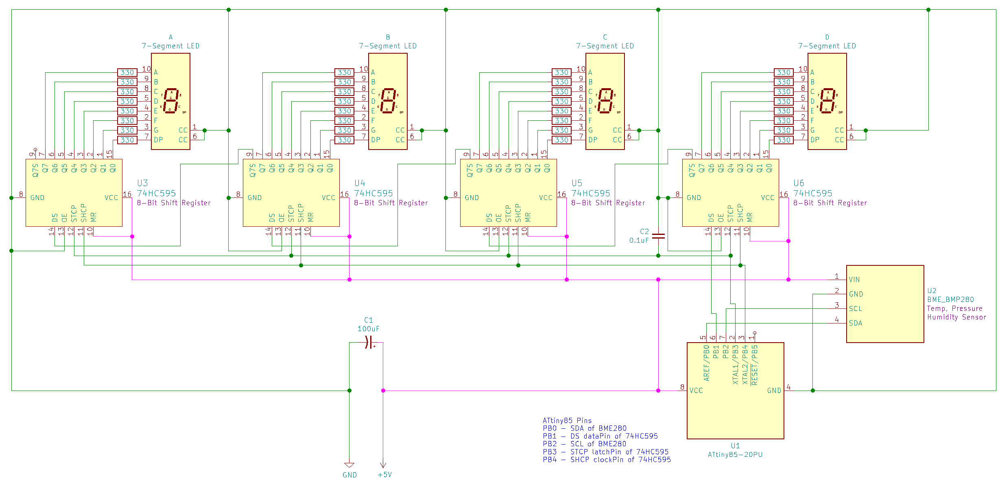
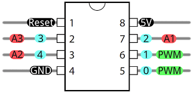
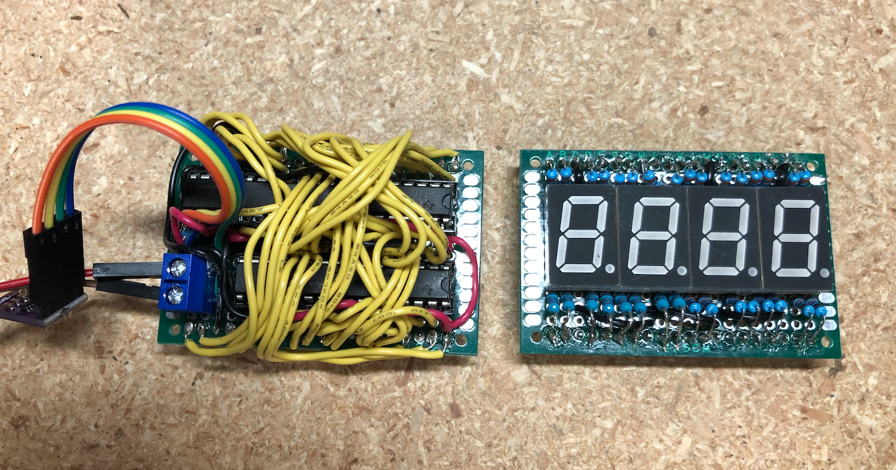
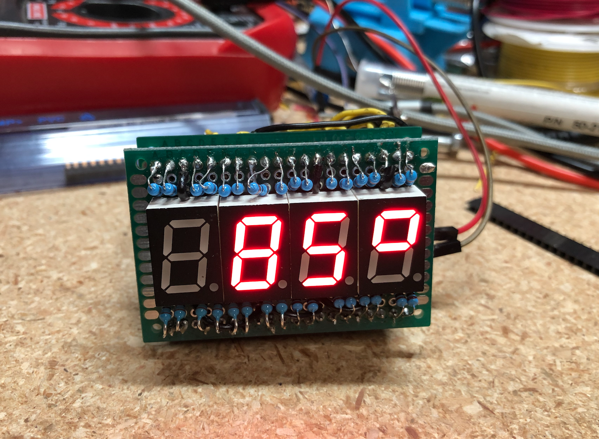
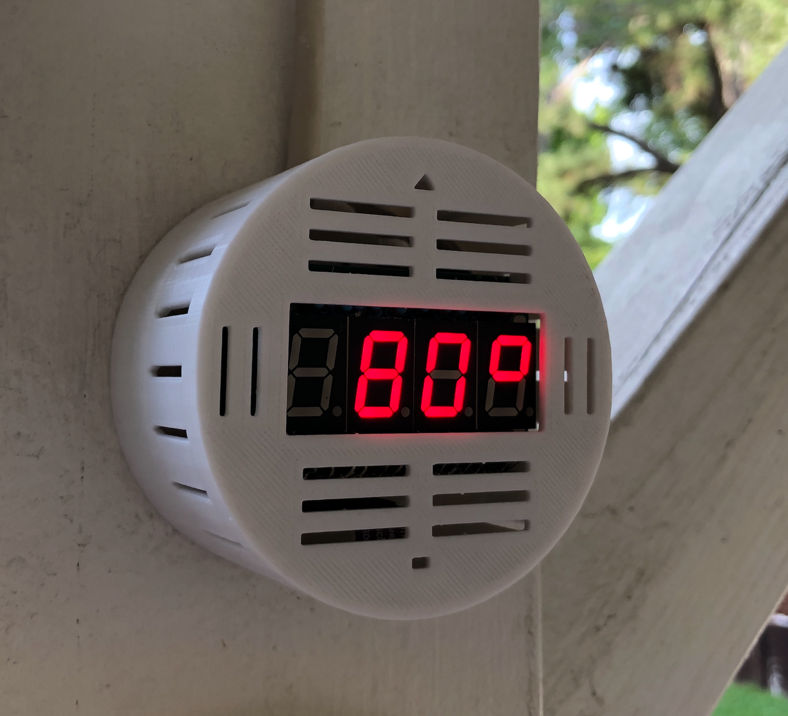

# ATtiny85 Weather Station #
[](https://travis-ci.org/jasonacox/ATtiny85-Weather-Station)

This project is an ATtiny85 based mini Weather Station that uses the BME-280 Sensor to measure and display temperature, humidity, and pressure via four 7-segment LED displays or using a TM1637 display module.  

## Requirements
This sketch requires a version of the Wire library that is compatible with the ATtiny85 for the I2C communication to work with the BME-280 sensor.  I used the [ATTinyCore arduino core by Spence Konde](https://github.com/SpenceKonde/ATTinyCore) which has a version of the Wire library that works with the ATtiny85 and was able to use the standard *Adafruit_BME280* library to pull data from the BME-280.  You can install *ATTinyCore* putting the board manager URL in the Arduino IDE preferences: `http://drazzy.com/package_drazzy.com_index.json`  
Set the board to the ATtiny85 chip at 1Mhz (internal).

## Circuit
Components:
* ATiny85 Microcontroller ([DigiKey](https://www.digikey.com/product-detail/en/microchip-technology/ATTINY85-20PU/ATTINY85-20PU-ND/735469))
* BME-280 Sensor (Temperature, Pressure, Humidity) ([Amazon](https://www.amazon.com/gp/product/B07KYJNFMD/ref=ppx_yo_dt_b_search_asin_title?ie=UTF8&psc=1))
#### Option A - Drive 7-Segment LED
* 74HC595 8-bit Shift Register (Qty 4) ([DigiKey](https://www.digikey.com/product-detail/en/texas-instruments/SN74HC595N/296-1600-5-ND/277246))
* 7-Segment LED Display (Qty 4) ([DigiKey](https://www.digikey.com/product-detail/en/inolux/INND-TS56RCB/1830-1161-ND/7604995))
* 0.1uF Ceramic Capacitor (Qty 2)
* 100uF Electrolytic Capacitor
#### Option B - TM1637 Display
* TM1637 Display Module ([Amazon](https://smile.amazon.com/HiLetgo-Digital-Segment-Display-Arduino/dp/B01DKISMXK/ref=sr_1_1_sspa?dchild=1&keywords=tm1637&qid=1615431417&sr=8-1-spons&psc=1&spLa=ZW5jcnlwdGVkUXVhbGlmaWVyPUExVlQ5SDUxUFhCWkYyJmVuY3J5cHRlZElkPUEwNTkwMDQ3V1pCOVNPRkc0TlkyJmVuY3J5cHRlZEFkSWQ9QTA1NTY1MTcyNklTTjZOV0o5MzZEJndpZGdldE5hbWU9c3BfYXRmJmFjdGlvbj1jbGlja1JlZGlyZWN0JmRvTm90TG9nQ2xpY2s9dHJ1ZQ==))
#### Power
* 5V Power Supply (Alternatively you can use a 5V Solar cell, 3.7V lithium ion battery and a TP4056 constant-current/constant-voltage linear charger to charge the battery during the day).

### Schematic (Option A - 7-Segment LED)


#### ATtiny85 Microcontroller



## Programming Notes:
I2C communication with BME-280 uses pins PB0/SDA and PB2/SCL. If you use the *Tiny AVR Programmer* from Sparkfun
or something similar it drives an LED on PB0 which will interfere with I2C communication. You will need to remove
the chip from the programmer after uploading to get it to work in the circuit.

## Memory Warning
This sketch uses nearly all of the ATtiny85 program storage space (8K) so you may get an overflow error if the libraries change or you add any code.

[UPDATE] I created a minimized BME280 library to reduce the PROGMEM space required.  You 
will need to clone/download and install the [https://github.com/jasonacox/Tiny_BME280_Library](https://github.com/jasonacox/Tiny_BME280_Library) library in your ~/Documents/Arduino/libraries/ directory and restart the Arduino IDE.
```bash
cd ~/Documents/Arduino/libraries
git clone https://github.com/jasonacox/Tiny_BME280_Library.git 
```

## Display
      [ 70'] - Temperature in degrees F (positive & negative)
      [ 24r] - Relative Humidity
      [_970] - Pressure in hPa with prefix for rising - or falling _ animation
      [ 21c] - Temperature in degrees C (positive & negative)

## Construction (Option A - 7-Segment LED)

I used two circuit boards: Display and Logic board.  The Display board holds the 4 LED 7-segment displays with the array of resistors. On the back are header pins that plug in to the logic board.  The Logic board holds the 4 register chips and the ATtiny85. On the back are headers for the Display board to plug in.

The Logic  and Display boards:


Both boards together and running:


I printed a simple cylinder case ([Thingiverse](https://www.thingiverse.com/thing:4432103)) to mount the weather station and have it on the back patio:


Arduino Sketch Code: [Here](https://github.com/jasonacox/ATtiny85-Weather-Station/tree/master/src/attiny85-temp-display)

## Construction (Opiton B - TM1637 Module)

                             +-------+
                            -|1  T  8|- V    (5V)
      TM1637  (CLKpin)  PB3 -|2  i  7|- PB2  (SCLpin)  BME280
      TM1637  (DIOpin)  PB4 -|3  n  6|- PB1
              (GND)       G -|5  y  5|- PN0  (SDApin)  BME280
                             +-------+   

Arduino Sketch Code: [Here](ahttps://github.com/jasonacox/ATtiny85-Weather-Station/tree/master/src/attiny85-temp-tm1637)


## Power Supply
The circuit will run on 5V or 3.3V.  I used an existing solar panel, battery and TP4056 charger circuit to power this project with a 3.3V regulator. 

#### Solar Power Option
* 1 x 2.5W 5V/500mAh Solar Cell - [Amazon](https://www.amazon.com/gp/product/B074TYH68Z/ref=ppx_yo_dt_b_search_asin_title?ie=UTF8&psc=1)
* 1 x 5V Micro USB 1A TP4056 Lithium Battery Charging Board with Protection Charger Module [Amazon](https://www.amazon.com/gp/product/B06XCXPY86/ref=ppx_yo_dt_b_search_asin_title?ie=UTF8&psc=1)
* 1 x 3.7V 3000mAh 755068 Battery Rechargeable Lithium Polymer ion Battery Pack - [Amazon](https://www.amazon.com/gp/product/B07TTD445R/ref=ppx_yo_dt_b_search_asin_title?ie=UTF8&psc=1)
* 1 x 3.3V Linear Regulator 250MA MCP1700-3302E/TO - [DigiKey](https://www.digikey.com/product-detail/en/microchip-technology/MCP1700-3302E-TO/MCP1700-3302E-TO-ND/652680)

